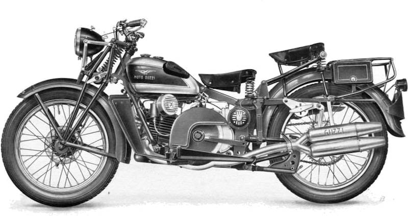
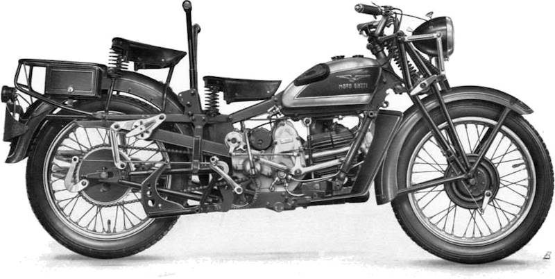

Each motorcycle has two identification numbers: The engine number is embossed on the 
distribution cover and the on the right side stand; the frame number is stamped on the right side of 
the frame under the seat. These numbers are used to identify the motorcycle. They must also be 
stated in case of request of spare parts.

### Spare parts

For the perfect functioning of the vehicle, please note that any spare parts are replaced 
exclusively with original "Moto Guzzi" parts. For ordering follow the instructions given 
in the chapter "Identification data".

 
*Fig. 1 - Motorcycle (flywheel side)*

 
*Fig. 2 - Motorcycle (distribution side)*