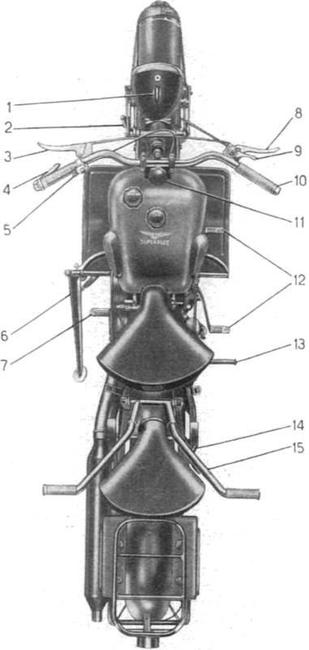

 
*Fig. 3 - Controls and Accesoires*

01. Key for the electrical system and light switch
02. Wing nuts for adjusting front shocks
03. Clutch lever
04. Valve lift (decompression) lever
05. Switch for high/low beam control and horn button
06. Sidestand
07. Rear brake pedal
08. Front brake lever
09. Air control lever
10. Throttle control
11. Steering friction adjuster
12. Gear lever
13. Kickstarter
14. Wing nuts for adjusting rear shocks
15. Rear handlebar

*N.B. - In the description, where it is written the right or the left is to be understood to the 
right or to the left of those who are in the saddle.*