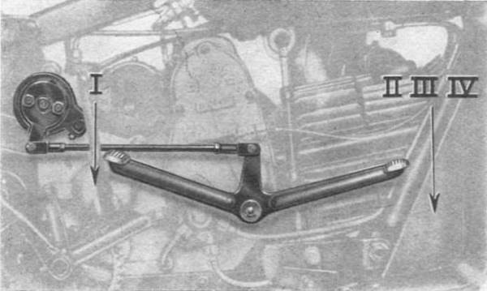

### Acceleration of the unladen motor

With the transmission in the neutral position, especially with a cold engine, it recommends that you 
do not overdo the acceleration of the engine.

### Normal use

The engine can reach a speed of 4300rpm. It is recommended not exceed this speed when engaged the 
lower gears. To monitor this we need to observe the maximum speed in any gear (see section "Performance").

Before starting the service, check the amount of fuel and lubricant existing in the tanks and make 
sure, after just starting the engine, that oil circles regularly: removing the oil tank cap you must 
see the lubricant out from the special recovery tube.

You should not travel downhill with the transmission in neutral or with the clutch disengaged: and 
you should always use engine braking by holding the throttle knob to the minimum opening. If the 
descent is strong you should use the lower gears; it avoids the excessive consumption of the brakes 
and thereby the excessive heating of the drums.

On a wet or icy road you must ride with the utmost caution avoiding sudden braking and rapid 
acceleration. It is advisable to decrease the normal tire pressure. 

Uphill is convenient to use the gear which allows the engine to run at a normal speed, so as not to 
force the engine.

### Usage of the key on the headlight

To operate the system, insert the key into the hole by pushing it to the end.

*Warning: Take care before starting the engine; The warning light should be illuminated.*

With the engine running, the warning light should go off; this means that the alternator supplies 
current. When the motor stops you must disengage the key from the working position (contact), 
otherwise the light will remain lit, discharging the battery.

### Starting the engine

Open the right tap of the petrol tank and make sure the fuel reaches the carburetor by pressing the 
small button which acts on the float. Periodically, you need to open the reserve valve to ensure 
proper operation; and clean any dirt deposits.  
Make sure the transmission is in the neutral position: the line drawn on the moving part of the 
switch must match the line drawn on the fixed parts. Slightly turn the throttle grip while holding 
the choke closed. Pull the valve lifter lever and press hard on the starter pedal; before 
it has completed its turn you have to release the valve lifter lever.  
It is advisable, especially in cold weather, to leave the bike running at lower engine rpm idle for 
a few minutes, and meanwhile open the choke lever to about the middle.   
The left valve must be kept closed, it needs to be used as the reserve and will therefore be open 
only in that case.

### Warm starting

It is advisable to open the choke about halfway, and you must not press the small button 
of the carburetor.

### Starting the motorcycle

After starting the engine, push forward the motorcycle so that the supporting stand is to be raised 
back to position. Climb aboard and you pull the clutch lever to the bottom, then engage the first 
gear and slowly let go the clutch lever at the same time accelerating the engine.

### Use of the gearbox

 
*Fig. 3b*

To move from lower to higher gears the clutch lever must be pulled to the bottom and simultaneously 
close the throttle. Move the gear shift lever (avoiding violent moves) in order to shift into higher
gear, slowly release the clutch, while revving up.  
To switch gears from higher to lower perform the same maneuver without completely closing the throttle.  
It is convenient to switch to a higher gear when the engine tends to assume a high rotation speed. 
It is convenient to go to the lower gears when the engine under load decreases speed.

### Use of the choke

Being a semi-automatic carburettor, maneuver the choke lever closed more or less depending on both 
the ambient temperature and the engine load conditions. It is obvious that when closing the air 
mixture is enriched and vice versa. Pretty much it is appropriate to reduce air opening when the 
engine is under heavy load and low rpm.

### Stopping the motorcycle

Taking away the throttle, press the rear brake pedal and pull the lever controlling the front brake; 
a few moments before the vehicle stops disengage the clutch and move the gearbox to the neutral 
position. In case of sudden braking on straight roads is convenient to use the two brakes 
simultaneously avoiding the locking of the wheels, thus assurering a good braking without risk of 
skidding.

### Stopping the Engine

Close the throttle, operate the valve lifter lever, close the fuel cock and remove the key from the 
contact position on the headlight.

### Back in the garage

It is advisable to carry out immediately a cursory external inspection of the motorcycle after 
return, especially after a journey made in bad weather or difficult road.

### Motorcycle storage in case of long inactivity

1. Perform the cleaning of the motorcycle (see chapter "General maintenance").
2. Put into the cylinder through the spark plug hole a bit of lubricant and make a few revolutions 
   of the engine by means of the kick starter, in order to evenly distribute a protective oil film 
   on inner walls.
3. Move the piston to the top dead center position with valves closed. For doing this you must turn 
   the flywheel until the arrow coincides with that printed on the crankcase cover, then observe (to 
   ensure that the valves are closed) by turning the flywheel a few centimeters, the rocker arms 
   remain still.
4. Put the machine on the centre stand to keep it off the ground, also the front wheel to protect 
   the rubber, especially if the floor is wet or greasy.
   
### Carburetion defects and remedies

If the engine does not start, or stops during riding, the causes can be:

- Lack of fuel: check if there is gas in the tank and if the tap is open;
- Obstruction of the tubes or petrol filters: clean, strongly blowing to remove the impurities;
- Carburetor jets clogged: remove and clean them with compressed air;
- Dirty carburetor: remove and clean it with gasoline and compressed air;
- Water in fuel, replace fuel, disassemble and clean the carburetor;
- Putting excessive fuel at the start: Close the tap and remove the excess fuel from the engine;
- Leaking of air into the intake pipe due to improper connection between pipe and carburetor or between pipe and cylinder head. Check tightness the bolts, put a new seal on the closing surfaces.

### Ignition problems and remedies

If the engine does not start, and the cause is not dependent on carburetion, look for the problem in ignition.  
To detect if the there is a spark, take the spark plug out of the engine, and place it on an 
uninsulated part of the cylinder, after connecting the wire that goes to the magnet, then let the 
engine turn a few times checking if the plug sparks. If it does not spark, the problem can be caused by:

- Spark plug is wet: let it dry;
- Spark plug dirty: clean it with pure gasoline and toothbrush;
- Cracked insulation: replace the plug;
- Spark plug does not fit in: check that the distance is 0.6 mm;
- Spark plug wire: make sure it is not broken, check the wire connection. 

If even with new spark plug it does not spark, check the contact breaker points: they must open 
0.4 mm and if dirty should be cleaned.

Too early or late spark: Check the timing of the magnet.

### Compression problems

The causes of too low compression can be:
- Loose nuts of the cylinder head and the cylinder;
- Spark plug not properly tightened or without sealing;
- Piston rings worn or broken;
- Oval cylinder;
- Bad sealing of the valve seats;
- Incorrect valve adjustment.

### Engine overheating

Possible causes include:
- Oil pump not working, not good quality or old oil, filters or clogged pipes;
- Late ignition;
- Lean mixture;
- Cooling fins covered with oil and dust.

### Good use of the motorcycle

Avoid riding agressively with hard braking and rapid acceleration; you should ride with constant speed.
This suggestion allows for fuel savings, reduced consumption of tires and normal wear and tear of all the parts that make up the motorcycle.

### Important Notice

It is advisable to check the tightness of all nuts and bolts after the motorcycle has traveled the 
first 500 km. In particular, a test should be carried out of the nuts that secure the motor head, 
when the engine is cold. These checks are always appropriate and should be carried out periodically, at least every 10,000 Km.  
Remember that the loosening of even one nut can cause serious mechanical breakdowns or accidents.