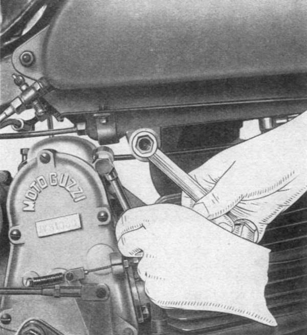
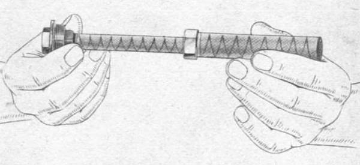

### Lubrication of the engine-gearbox unit

In this type of engine, the oil has not only the function of lubricating, but also has the important 
function of cooling the motor, performing the same function as water in water cooling motors. A gear 
pump sucks the oil from the tank and injects it in the crankshaft on the side of the distribution. 
The oil then runs through the holes inside the crankshaft and flows from holes drilled in it under 
the big end bearing. After lubrificating the latter, the oil, passing through the roller bearing of 
the connecting rod head, comes out to the sides, and, by centrifugal force, reaches the piston pin, 
the piston and on the cylinder walls, as well as on the transmission gears, lubricating and cooling 
the internal parts. The excess oil is driven back into the crankcase using a special ring on the 
piston, and collects at the bottom. From here, by means of a coaxial vane pump inside the oil pump, 
the oil is sucked out and pushed back in the tank.

It is noted that the direction of rotation of the motor, contrary to the driving direction, combined
with the horizontal arrangement of the cylinder favors the perfect lubrication of the cylinder 
itself, since the oil droplets are projected by centrifugal force to the upper part of the 
cylinder, where gravity createas drops to lubricate the bottom.

##### Important notice

For engine lubrication is recommended to use the following oil:

Below 10° | Shell X-100 SAE 30;
Above 10° | Shell X-100 SAE 40.

After covering the first 500 km it is necessary to completely empty the oil tank and replaced it 
with fresh oil: Afterwards renewing the oil approximately every 2000 km. This must be carried out 
when the engine is hot. Remove the filter from the tank by removing the perforated pipe fixing bolt 
and the nut which holds the filters (**Fig. 4**).

 
*Fig. 4*

Remove them from each other by unscrewing the nut that holds the internal small filter to the 
outside (**Fig. 4b**) and clean them thoroughly.

 
*Fig. 4b*

It is advisable to clean all pipes; Take extreme care in reassembling them in order to avoid oil 
leakage or air leaks which could cause bad operation of the pump, causing serious damage to the engine.
On the pump is mounted an automatic check valve. Never tamper with this device, it has been adjusted 
in the factory.  
The most secure and convenient way to make sure the bike does not miss the engine oil is checking the 
oil return pipe near the tank. It, after a few minutes of travel, should be warm.

After the first 500 km it is necessary to wash and lubricate the clutch; This must also be carried 
out periodically, about every 2000 km. To do this see what has been said about it in the chapter 
"**Clutch adjustment**".

#### Lubrication of other parts

It is recommended to lubricate all grease nipples on the front fork and rear swingarm. This should 
be done approximately every 1000 km.
Keep the ball bearings of the clutch actuator and bolts lubricated. The bearings of the wheel hub 
and the magnet of the dynamo do not require lubrication other than at long intervals. This operation 
will take place at the General Revision of the motorcycle.  
Lubricate, once a year, the springs of the rear swingarm contained in the bottom box.  
For these operations we recommend *Shell Retinax A*.

#### Lubricating the drive chain

Although the chain is automatically lubricated by the breather that ends at the front chain sprocket 
it is recommended to wash the chain with oil or diesel every 1,000 Km. Then cover it with *Shell 
Retinax A*.