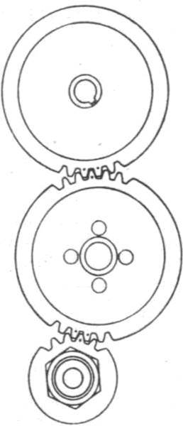
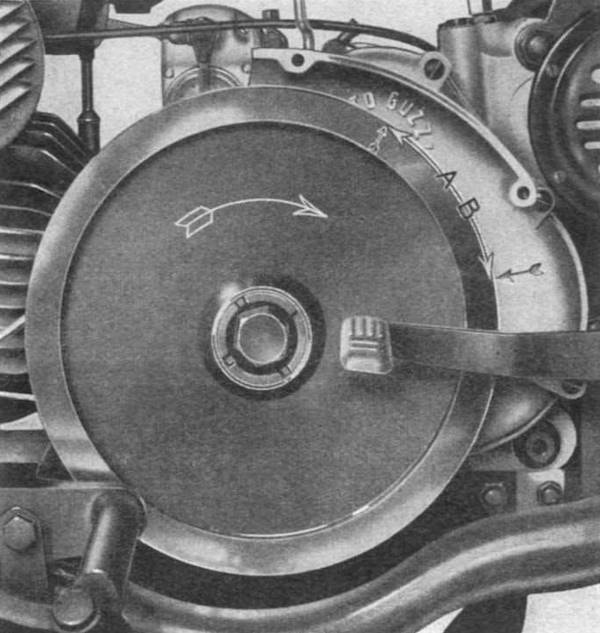
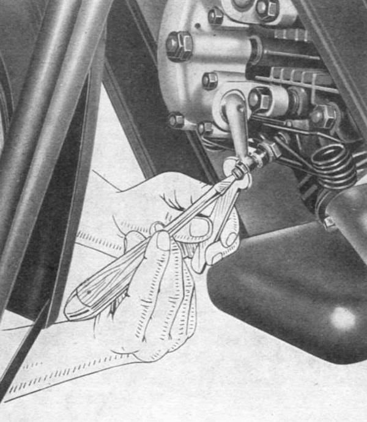

### Timing of the distribution

For setting the distribution timing it is necessary to adjust the rocker arms so that the gap is 
about 0.20 mm for both valves; this is accomplished with the piston at the top dead center, with 
valves closed and precisely at the end of the compression phase.

Then, after you make almost a full turn of the the flywheel, check that the intake valve begins to 
open when the arrow on the flywheel is in the advance position by the arrow drawn on the lid by **55 mm**; 
When setting the intake valve timing this way, the exhaust valve is also in phase.

NB. - This measure is to be taken on the outer edge of the flywheel (**Fig. 5b - A**).

After this check, the valve play must be set as prescribed in the section entitled "**Setting valve play**".

When the piston is at top dead center, with valves closed and precisely at the end of the 
compression phase the marked tooth on the crankshaft gear must sit between the marked teeth of the 
cam shaft and the marked tooth of the latter must sit between the marked teeth on the magnet drive 
gear (**Fig. 5**).

 
*Fig. 5*

### Timing of the magnet

When the motor is approximately at the end of the compression phase, with the piston near the top 
dead center and closed valves, the contact breaker pins must begin to open when the arrow marked on 
the flywheel is in the advance position from the plotted arrow on the flywheel by **30 à 31 mm**.

NB. - This measure is to be taken on the outer edge of the flywheel (**Fig. 5b - B**).

 
*Fig. 5b - A = 55 mm, B = 30 to 31 mm*

### Setting valve play

This is performed on a cold engine, using key 11 mm and a screw driver. Loosen the securing nut and 
by tightening or loosening the screw that acts on the valve stem, screwing you decrease the play and 
vice versa. The prescribed free play is 0.05 mm for the intake and 0.3 mm for exhaust. Check said 
play with the appropriate thickness gauges. Following adjustment, firmly holding the screw, lock the 
nut (**Fig. 6**).

Note: Check the valve play again after the work is finished. It may happen that the valve play 
changes while tightening the securing nut. 

The adjustment must be done with the piston at top dead center with valves closed and precisely at 
the end of the compression phase.

 
*Fig. 6*

### Ignition

The ignition is ensured by the magnet. Check the breaker points, and, if necessary, clean them with 
a special smooth file. The opening of the points must be 0.4 mm; should it be bigger or smaller, 
adjust the gap as follows:

Remove the cover from the magnet, then with a screwdriver, loosen one half turn the screw that holds 
the bracket containing the fixed contact, and move the bracket by slightly turning the special 
eccentric screw just enough to get the prescribed contact gap, and finally lock the bracket again. 
Carry out this adjustment with the points in the fully open position.

During the adjustment proceed with the lubrication of felt brush using special oil. It is 
recommended not to overdo the lubrication.

### Spark plug

Check the condition of the insulation: If it has cracked or broken replace the spark plug. The 
distance between the electrodes must be of 0.6 mm.

To clean it yuse pure gasoline and a toothbrush. Do not change the type of spark plug. Remember that 
many engine ploblems can be prevented with consistent use of a correct type of spark plug.
