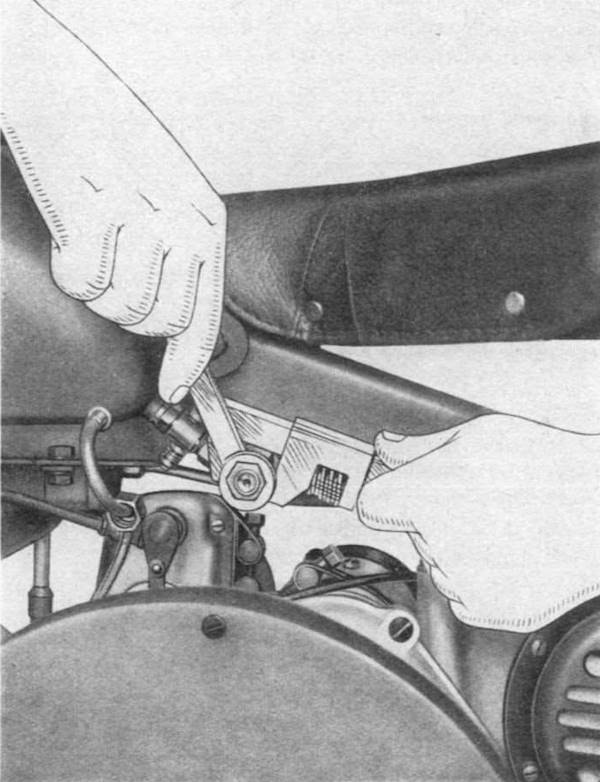

### Carburetor

Around every 5000 km it is appropriate to carry out cleaning of fuel filters, pipe and carburetor. 
The filters are located on top of each fuel tap, and in the tubing below the taps (**Fig. 6b**).

 
*Fig. 6b*

Properly clean the float chamber, and make sure the tube that carries gasoline from the chamber to 
the jet is clean (clean with pressured air).
For cleaning of all holes is recommended to use pressured air and it is not recommended to use 
wires, needles, etc., which could alter the diameter of the holes and make the carburetor adjustment 
difficult.

#### Normal adjustment

Diffuser | 27 mm
Main jet | 115/100 summer
         | 118/100 winter
Idle jet | 50/100
Slide    | # 70
Needle   | # 5

#### Setting the running mixture

This is influenced by the jet diameter (replacing the latter with one having higher or lower 
numbering) and by the position of the needle. Increasing the number of the jet and raise the needle 
to enrich the mixture ratio, the opposite occurs decreasing the jet size and lowering the needle.

Rich mixture clues: excessive consumption, dark soothy deposits on the spark plug.
Lean mixture clues: backfire to the carburetor, dry light gray spark plug.

Remember that with a lower ambient temperature the mixture should be enriched; and with higher 
temperatures it should be more lean.

#### Idle setting

This should be carried out with a warm engine. It is adjusted with two screws; one horizontal placed 
immediately after the throttle slide adjusts the minimum. Screwing this screw into place enriches 
the mixture and vice versa. The other screw, inclined to the axis of the carburetor body, sets the 
"fully closed position" of the throttle slide.  
First adjust the inclined screw so that with the throttle "fully closed" the engine can run even at 
low rpm. Then screw or unscrew, as appropriate, the horizontal screw until the desired minimum.

Carefully check that there are no air leaks between the carburettor and pipe, or between pipe and 
head; leaks can prevent proper adjustment of the idle.

### Air filter

The carburetor is fitted with a small removable air filter. Every 2000 Km, it is necessary to 
disassemble the filter and clean it thoroughly by washing it with gasoline. Immerse the metal mesh 
in a mixture of diesel and light oil at 1:1 and let drain well before reinstalling.

Remember, that the effectiveness of the filter reduces to zero, if you do not carefully clean it as 
indicated above. Furthermore, when the filter is very dirty, the gasoline consumption greatly 
increases as a result of the choked air supply.

### Cleaning the exhaust

Approximately every 10,000 km remove carbon deposits filling the muffler with a 20% solution of 
caustic soda with boiling water. After about an hour empty the muffler, then fill it with boiling 
water and shake it strongly before emptying it.