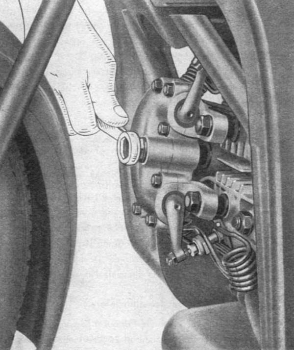
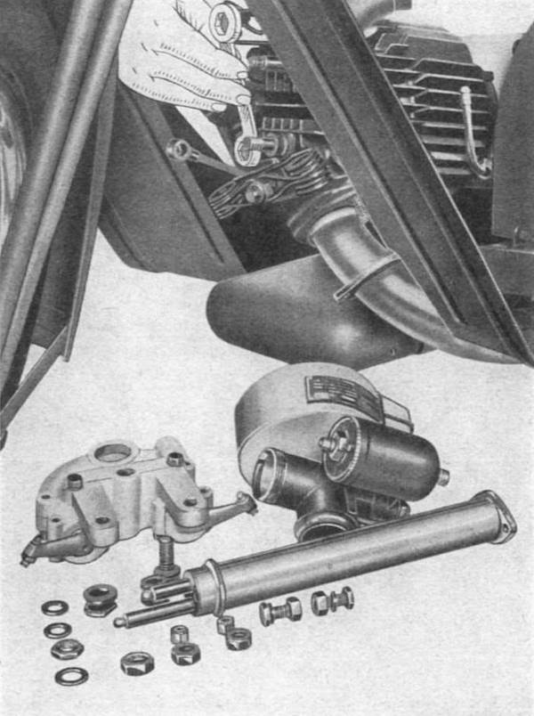

### Head and valves

Approximately every 5000 km clean the combustion chamber, possibly grind the valves.

#### Removing the head

Takes off the rockerbox from the head by releasing the oil pipe and the mounting nuts to the three 
supporting studs (**Fig. 7**).

 
*Fig. 7*

Remove the tube covering the pushrods after loosening the nuts that hold the flange to the engine 
housing. Remove the carburetor, the exhaust pipe and the four nuts on the cylinder head bolts 
(**Fig. 8**), then hit around the outside of the head with a hammer, and remove it by pulling it 
forward.

 
*Fig. 8*

To ensure that the valves seal perfectly in the respective seats pour a bit of gasoline in the 
intake and exhaust ducts and observe if the liquid leaks to the inside. If it shows a faulty seal it 
is necessary to disassemble the valve and grind of these on their respective locations. Proceed to 
the complete dismantling of the valve springs, plates and valves. For cleaning it is good to use 
beveled scrapers and wire brushes.

For grinding use a special paste, after grinding thoroughly wash the cylinder head to make sure it 
is free of all traces of abrasive. The cleaning of the upper part of the piston is carried out with 
scraper and wire brush. If you remove the cylinder and the piston, it is best not to rotate the 
sealing rings on the piston; If these rings are removed from the piston, during the reassembly be 
careful not to exchange them or turn them upside down.
Remember to install new seals: between cylinder and head, copper and asbestos; between the cylinder 
and crankcase, of approximately 0.3 mm thick gasket paper.
