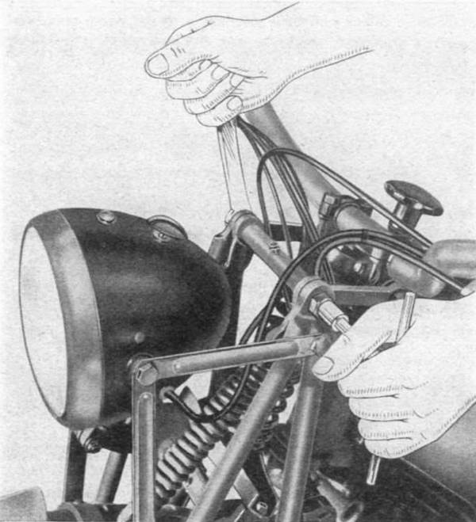
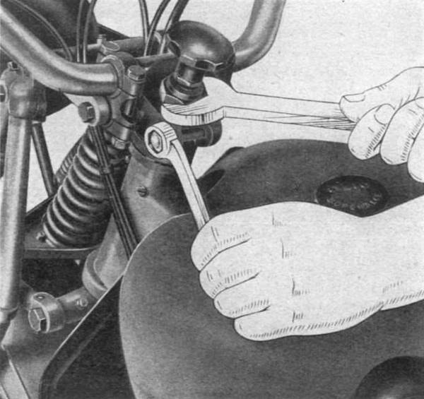
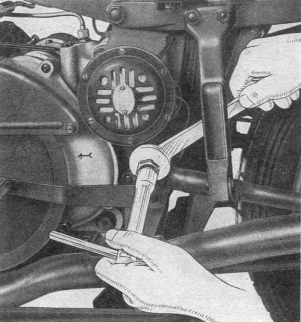
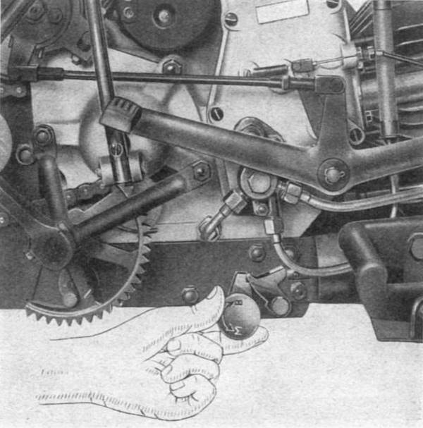

### Adjusting the front fork

- Top pivot: Loosen the two nuts then act on the framework of the pivot with a appropriate key; After adjustment to lock the two nuts (**Fig. 10**).
   
  *Fig. 10*

- Pivot for top yoke: Loosen the nut on the right then tighten or loosen the amount needed for 
  adjusting the pivot using the hexagonal ends. When the operation is complete tighten the nut again.
- Central pivot: Loosen the nuts of the wingnut dampers .Tighten or loosen the pivot to obtain the 
  adjustment, then tighten the nuts.
- Pivot for bottom yoke: Loosen the right nut and the bolt locking the left pivot shackle; then 
  tighten or loosen the pivot with a appropriate key using the hexagonal ends: after adjustment 
  tighten the nut and bolt on the shackle.
  
### Adjusting the steering

If the steering has free play in the bearings they are subjected to harmful vibration. To adjust: 
loosen the nut on the bolt tightening the steering head, then tighten the lock nut for the steering 
placed under the adjustment handwheel of the steering damper (**Fig. 10b**) so that there is no more 
play while maintaining free movement of the fork. When adjusting remember to re-tighten the nut to 
the bolt tightening the steering head.

 
*Fig. 10b*

### Adjustment of the swing arm

First loosen the two nuts, then turn the pivot the required amount (right to left to loosen and 
tighten) using the square of the pivot end. After adjustment you tighten the nuts (**Fig. 11**).

 
*Fig. 11*

The springs are carefully assembled to size at the factory, so it is inadvisable to change the 
tension. For a control, the measurement from the bottom of the box to the ends of the springs row 
plate must be 235 mm.

For two-person riding set the suspension by turning the handwheel to the complete right; for riding
alone turn said handwheel fully left. This operation is to be carried out with the machine on the 
center stand (**Fig. 12**).

 
*Fig. 12*