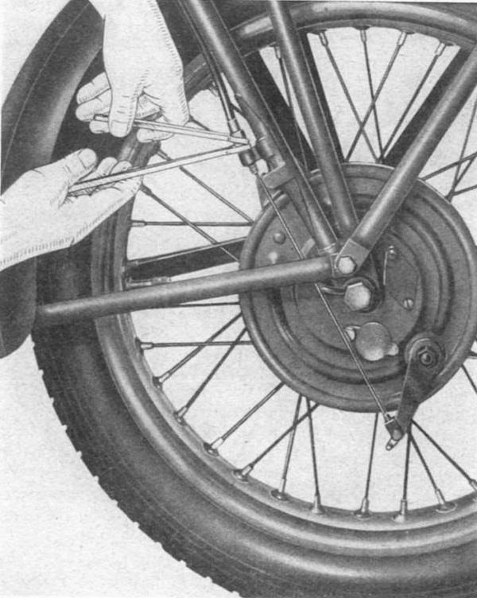
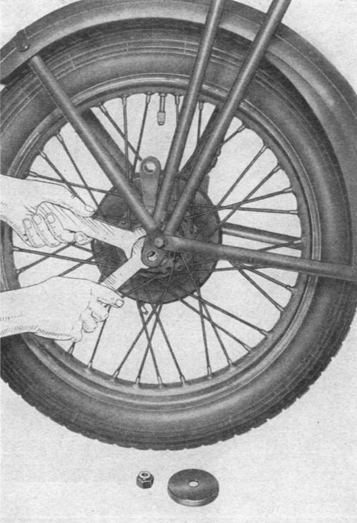
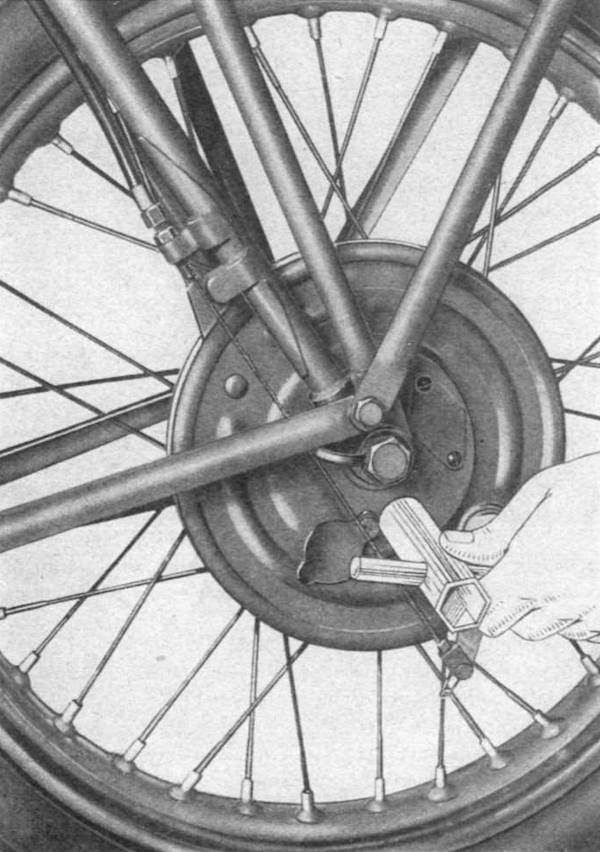

### Adjustment of the brakes

For a good adjustment is necessary there is a play (measured at the end of the pedal if this is the 
rear brake, and the end of the hand lever in the case of front brake) of about mm. 10 to 15 mm, 
before the friction material is in contact with the drums.  
This play is adjusted by acting on the tensioner located on the right side of the fork for the front 
brake (**Fig. 13**) and by screwing the wing nut on the tie rod for the rear brake.

 
*Fig. 13*

### Adjustment of the hubs

The hubs, being equipped with tapered roller bearings, are adjustable. To eliminate excessive axial 
play unscrew the central axle nut on the left side and pull the pin on the right side, then remove 
the dust cover cap and thick spacer. With special keys (**Fig. 14**), loosen the securing nut and 
screw the ring just enough to remove the excessive play; afterwards, make sure that the wheel turns 
freely, to make certain that the roller bearings are not stressed causing rolling resistance and 
rapid wear of the parts. Before assembly remember to relock the nut on the ring of the hub.

 
*Fig. 14*

### Wheel removal

Being interchangeable, the wheels can be mounted both on the front and rear. To disassemble remove 
the axle by undoing the left nut, then use the pipe wrench on the fixed side of the axle 
(**Fig. 15**) to unscrew and remove the three bolts that secure the drum brake on the wheel. After 
that take off the wheel.

 
*Fig. 15*
