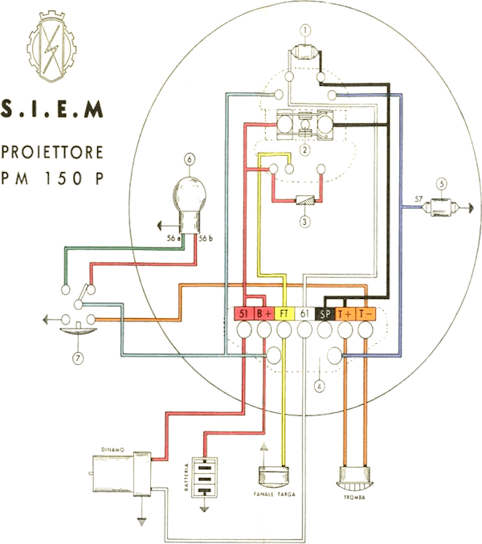

### Dynamo

Every 10,000 km check the status of the brushes. These must slide freely within their guides, if 
they are dirty should be cleaned and replaced if worn. Check the condition of the collector; if it 
is blackened clean it with petrol (do not use petroleum or sandpaper, even if very fine grain).
The bearings do not require lubrication other than at long intervals.

### Battery

In order to access the battery do the following: Remove the plate with the rear handlebar held by 4 
bolts, turn over the saddle and unscrew the bolt holding the battery clamp.
For the maintenance and preservation, the recommended standards are: periodically checking the acid 
level and if necessary add distilled water so that the upper edge of the plates are submerged by 
about 5mm. This should be performed more frequently in summer months (every 30 days), while in the 
winter months it can be done less often.  
It is advisable to keep dry and clean the terminals and the top of the battery cells. It is useful 
to grease the threaded part of the terminals with vaseline.

If the motorcycle has to stand idle longer recharge the battery every couple of months; not doing so 
the battery will deteriorate quickly.

The battery is discharged when, not charging, it has a voltage lower than 5.4 V and the density of 
the acid is of about 20 Bé°. It should be recharged with an intensity of about 1 A up to reach 30 Bé°.

### Cables

Check the external condition especially in places where there is sliding between metallic and 
isolated parts. If you find defects, replace the cables.

### Front light

It is watertight, which makes virtually unnecessary to do internal inspection. Remember that the 
mirror surface of the reflector must not be cleaned because it easily scratches and loses reflection.
The focus is fixed; the focus is set by the bulb filament.

### Light bulbs

Use bulbs of equal size and power of those mounted.

Front light:   | Double beam head light bulb   | 6 V - 25/25 W 
               | City torpedo light bulb       | 6 V - 5 W
               | Charge indicator torpedo bulb | 6 V - 1.5 W
For tail light:| Torpedo bulb                  | 6 V - 3 W.

### Claxon button and high beam switch

No maintenance is needed on the electrical switch. In case of irregularities remove the cover and 
check the contacts and the tightness of the small screws for wire connection.

### Electric horn

During operation of the horn it can occor that, because movement of some parts or for the wear of 
others, the sound is no longer normal. It is thus required to adjust the sound settings. Having 
checked that the battery is charged, unmount the horn and on the back adjust the sound by turning 
the button head screw located on the left.
This screw has a cone under knurled head, so that, by turning to the right or to the left, you will 
hear the click of the teeth. After removing the screwdriver, it will remain in the location where 
the best sound is produced.

